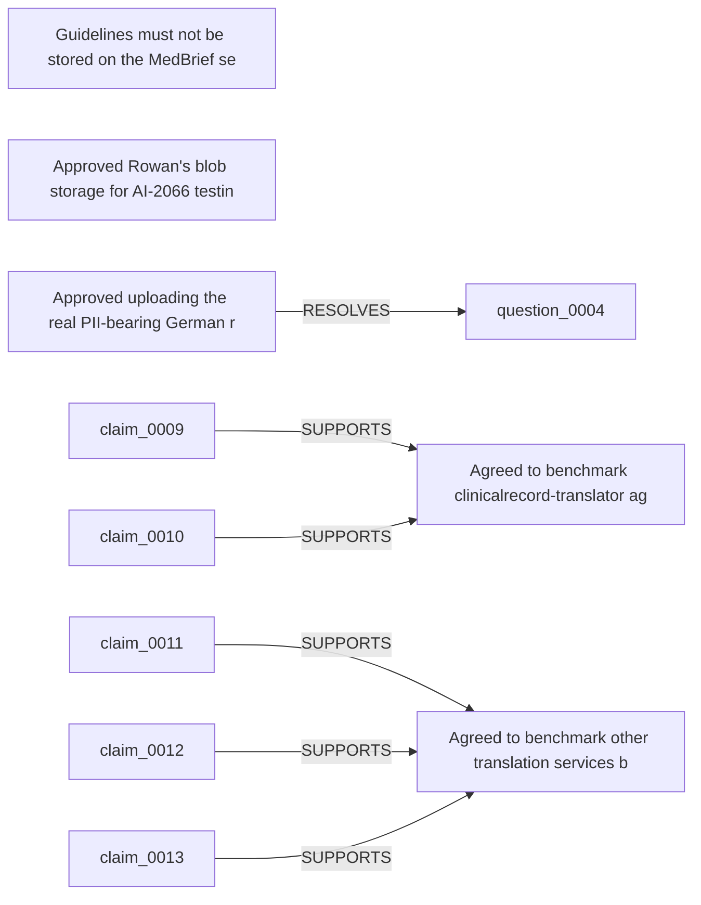
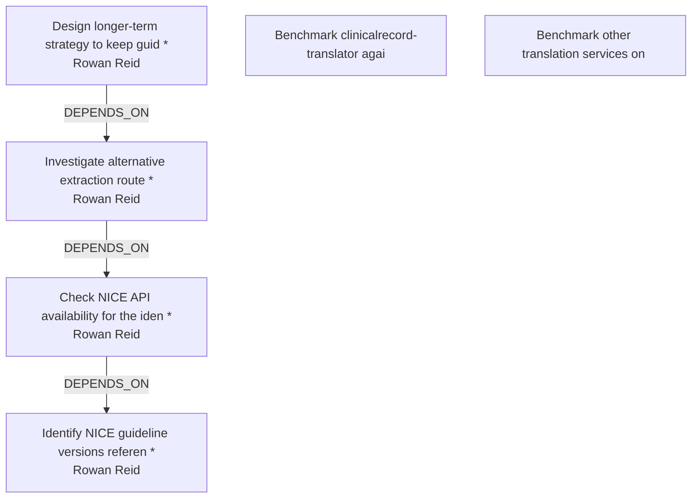
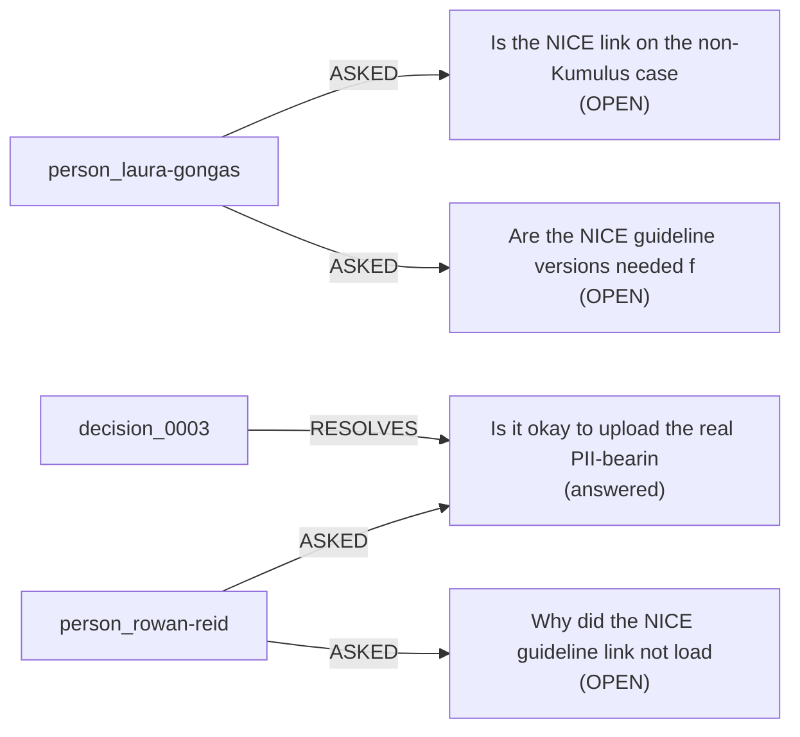

# Graph views (Mermaid)

These render inline in Obsidian. For the full interactive graph open `graph.html`.

## Decisions

```mermaid
flowchart LR
  decision_0001["Guidelines must not be stored on the MedBrief se"]
  decision_0002["Approved Rowan's blob storage for AI-2066 testin"]
  decision_0003["Approved uploading the real PII-bearing German r"]
  decision_0004["Agreed to benchmark clinicalrecord-translator ag"]
  decision_0005["Agreed to benchmark other translation services b"]
  claim_0009 -->|SUPPORTS| decision_0004
  claim_0010 -->|SUPPORTS| decision_0004
  claim_0011 -->|SUPPORTS| decision_0005
  claim_0012 -->|SUPPORTS| decision_0005
  claim_0013 -->|SUPPORTS| decision_0005
  decision_0003 -->|RESOLVES| question_0004
```

## Action items (dependency DAG)

```mermaid
flowchart TD
  action_0001["Identify NICE guideline versions referen *<br/>Rowan Reid"]
  action_0002["Check NICE API availability for the iden *<br/>Rowan Reid"]
  action_0003["Investigate alternative extraction route *<br/>Rowan Reid"]
  action_0004["Design longer-term strategy to keep guid *<br/>Rowan Reid"]
  action_0005["Benchmark clinicalrecord-translator agai<br/>"]
  action_0006["Benchmark other translation services on <br/>"]
  action_0002 -->|DEPENDS_ON| action_0001
  action_0003 -->|DEPENDS_ON| action_0002
  action_0004 -->|DEPENDS_ON| action_0003
```

## Questions and answers

```mermaid
flowchart LR
  question_0001["Are the NICE guideline versions needed f<br/>(OPEN)"]
  question_0002["Is the NICE link on the non-Kumulus case<br/>(OPEN)"]
  question_0003["Why did the NICE guideline link not load<br/>(OPEN)"]
  question_0004["Is it okay to upload the real PII-bearin<br/>(answered)"]
  decision_0003 -->|RESOLVES| question_0004
  person_laura-gongas -->|ASKED| question_0001
  person_laura-gongas -->|ASKED| question_0002
  person_rowan-reid -->|ASKED| question_0003
  person_rowan-reid -->|ASKED| question_0004
```

